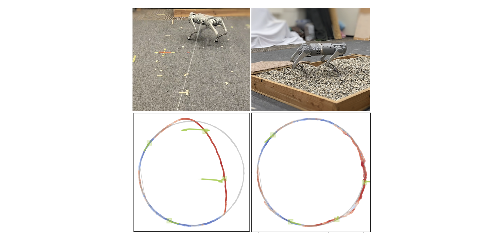

# Introduction
Software infrastructure for out-of-distribution detection with a real quadrupedal robot based on Gaussian process state-space models. This repository implements the experiments of the paper:

> Out of Distribution Detection via Domain-Informed Gaussian Process State Space Models
> Alonso Marco, Elias Morley, Claire J. Tomlin
> 2023 IEEE 62nd Conference on Decision and Control (CDC)



It features as prediction module (C++) for fast rolling-out of state trajectories. Implemented using [Eigen](https://eigen.tuxfamily.org/) and [pybind11](https://github.com/pybind/pybind11)


### Installation notes

```bash
conda create -n ood python=3.7

pip install tensorflow
pip install tensorflow_probability
pip install numpy scipy matplotlib==3.2.2
pip install hydra-core --upgrade
pip install control
pip install -e .
cd <path/to/LQRker>
pip install -e .
```